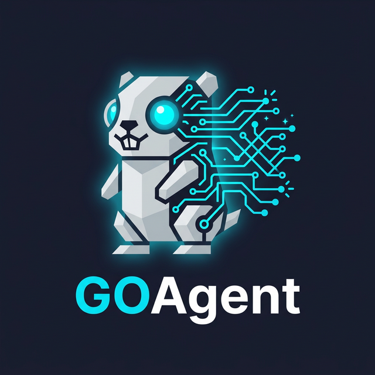
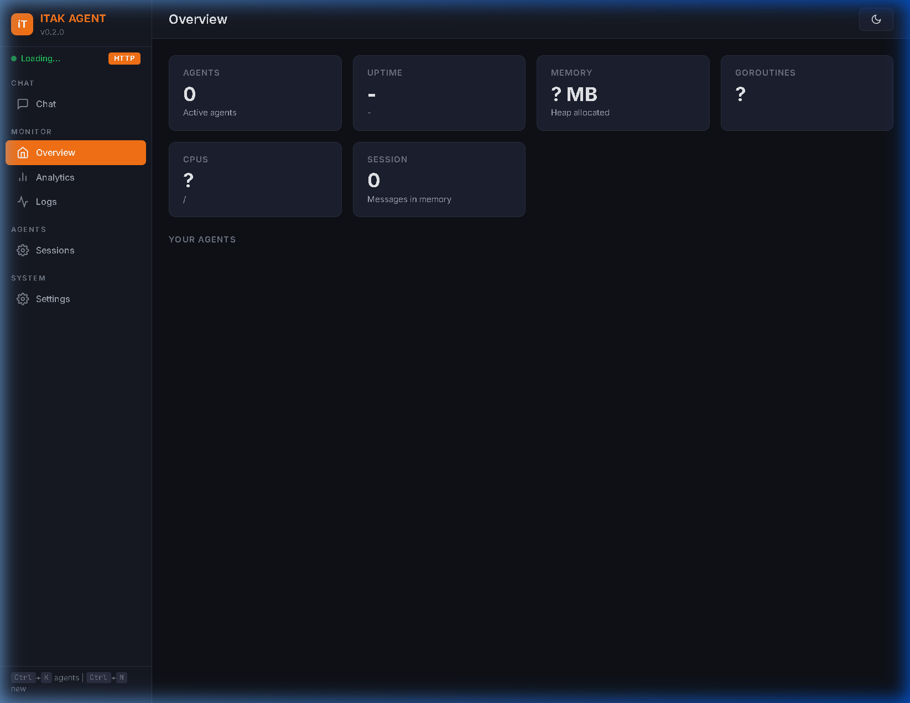
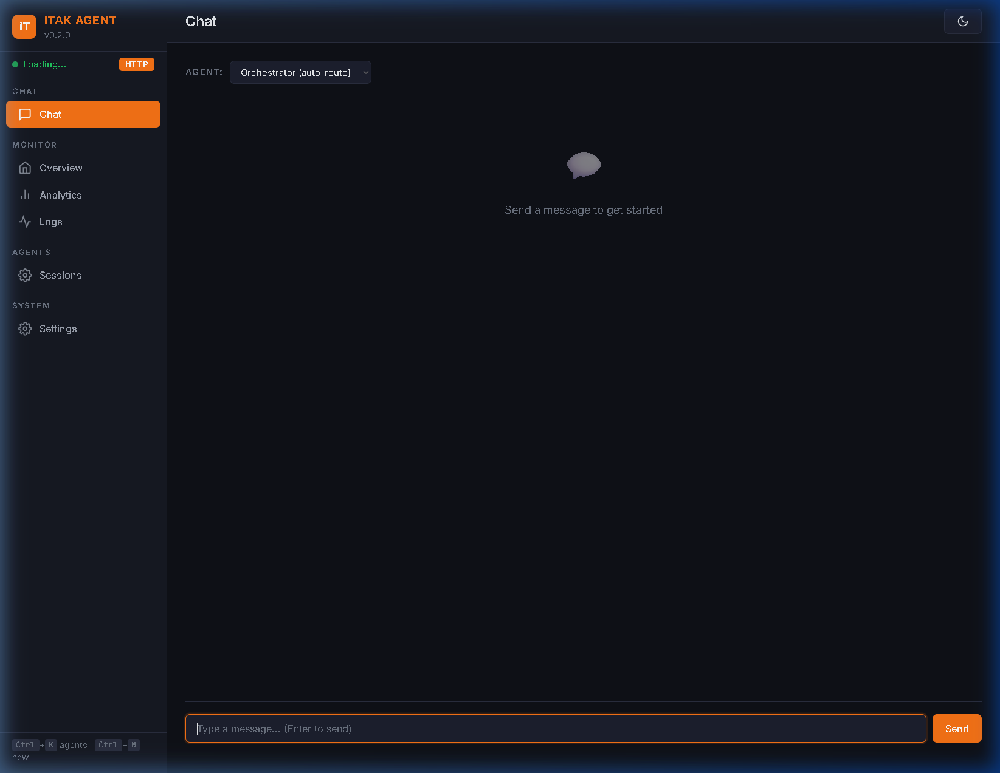
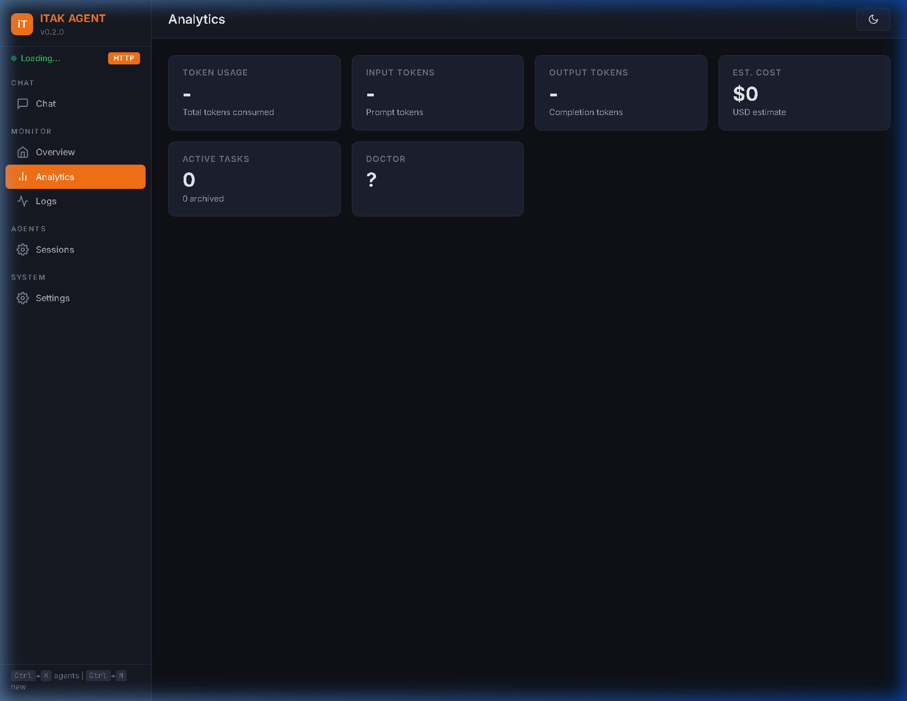
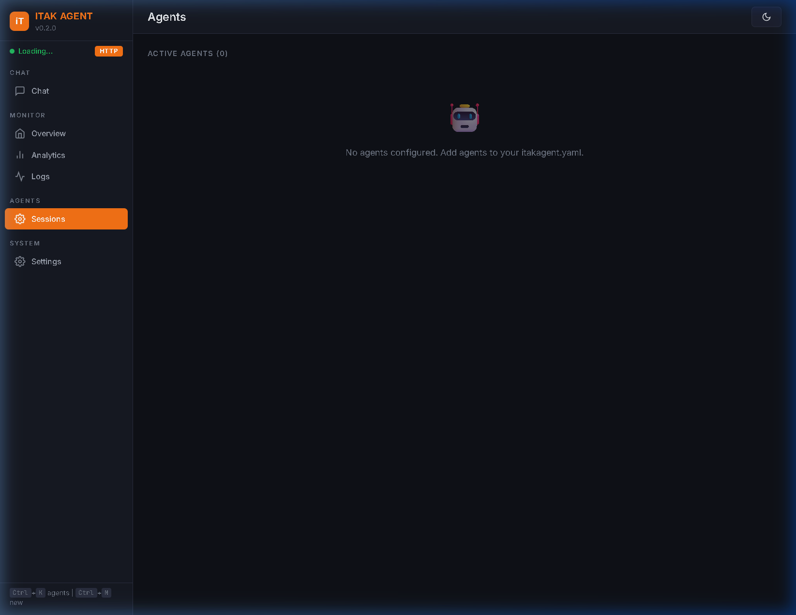
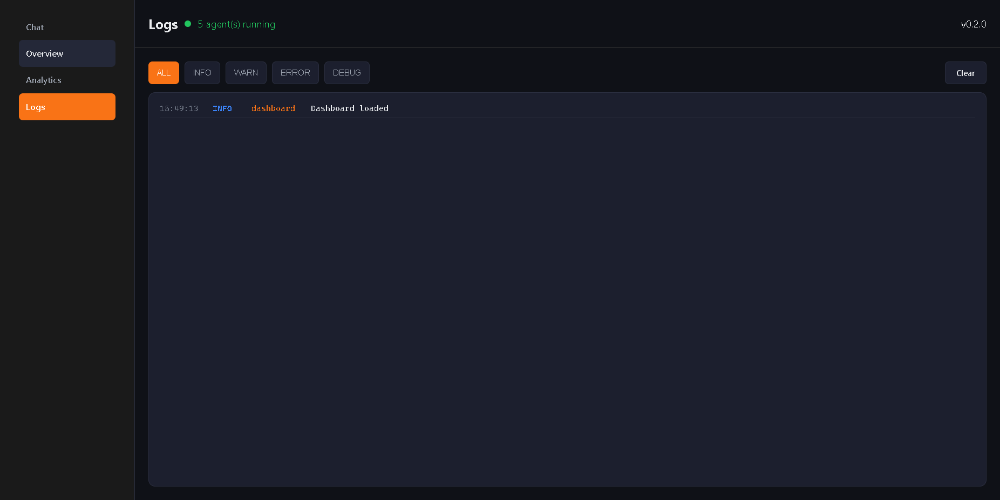
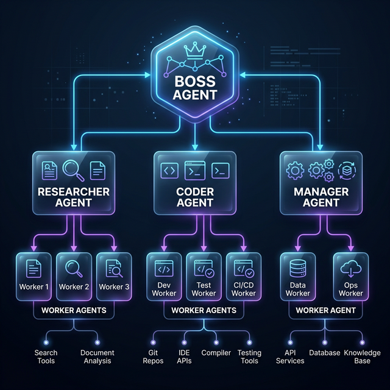

<div align="center">
  
  <h1>iTaK Agent</h1>
  <p><strong>An AI agent framework written in Go. One boss delegates to focused agents who get work done.</strong></p>
  <p>Runs on small local models. No expensive API bills required.</p>

  <br/>

  
  
  
  

</div>

> [!IMPORTANT]
> The **iTaK Agent** is a fully bundled AI ecosystem. While it features an orchestrator (**iTaK Core**), advanced graph memory (**iTaK Memory**), and robust security guardrails (**iTaK Shield**) neatly embedded into a single binary with a native HTML dashboard, **each of these sub-systems is built as an individual, reusable component**. This means you can use the iTaK Agent out-of-the-box, or extract its components for your own standalone projects!

---

## 📑 Table of Contents
- [🖥 Dashboard UI](#-dashboard-ui)
- [🤖 What Is iTaK Agent?](#-what-is-itak-agent)
- [⚡ How It Works](#-how-it-works)
- [🚀 Quick Start](#-quick-start)
- [⚙️ Configuration Guide](#-configuration-guide)
- [🧰 Built-in Tools](#-built-in-tools)
- [🧠 Hybrid Memory Architecture](#-hybrid-memory-architecture)
- [🧩 Extension System (GOHub)](#-extension-system-gohub)
- [🛡️ iTaK Shield (Embedded Guardrails)](#️-itak-shield-embedded-guardrails)
- [🛠 Extending the Agent](#-extending-the-agent)

---

## 🖥 Dashboard UI

iTaK Agent features a beautiful, real-time dashboard served directly from the embedded Go binary to monitor memory, sessions, tokens, and agent activity.

<div align="center">
  
</div>

### Features
- **Real-Time Overview**: Live metrics on system memory, goroutines, and auto-healing Doctor status.
- **Embedded Chat UI**: Chat directly with individual agent personas to isolate contexts.
- **Advanced Analytics**: Track exact token usage per model and real-time generation speeds.
- **Session Management**: Review the persistent conversation workspaces handling your agents.

<details>
<summary>Click to view more screenshots</summary>

**Chat Interface**


**System Analytics & Token tracking**


**Live Active Sessions**


**File System Activity Stream**


</details>

---

## 🤖 What Is iTaK Agent?

iTaK Agent is a dual-purpose AI framework built in **Go**.

Its primary form is a **fully bundled, batteries-included agent** that features an embedded Core orchestrator, integrated Memory, and native Shield guardrails—all optimized to work seamlessly with **smaller, efficient models** you can run locally.

However, its secret weapon is its **modular architecture**. Every major piece of the iTaK Agent is built as an individual component first. This allows the open-source community to use iTaK components (like the security guardrails or the memory system) independently in other projects, while the main iTaK Agent bundles them all together for the ultimate out-of-the-box experience.

The core idea: **keep the boss simple and the agents focused.**

- The **Boss (Orchestrator)** never touches tools. It just figures out what needs to happen and hands off work.
- **Focused Agents** (like researcher, coder, browser) each have a small set of tools, clear goals, and a specific job.
- Each agent only sees what it needs. This keeps things fast and cheap.

### Why Go?

| Feature | Why It Matters |
|---|---|
| **Single binary** | No virtual environments, no `pip install`, no dependency problems |
| **Fast startup** | Agents start in milliseconds, not seconds |
| **Cross-platform** | Same binary runs on Windows, Linux, macOS, Docker |
| **Low memory** | Uses way less memory than Python frameworks |
| **Easy deployment** | Copy one file to your server and run it |

---

## ⚡ How It Works

<div align="center">
  
</div>

### Step by Step

1. **You type a message** - `"Fetch google.com and save the HTML to output.html"`
2. **Boss thinks** - "This needs HTTP fetching AND file writing. I'll send it to `researcher`."
3. **Boss sends a task** - `{ agent: "researcher", task: "Fetch google.com and save to output.html" }`
4. **Researcher does the work** - calls `http_fetch` to get the HTML, then calls `file_write` to save it
5. **Result comes back** - Boss gives you a clean answer: *"Done! Saved Google's HTML to output.html (52KB)"*

---

## 🚀 Quick Start

### What You Need

- **Go 1.22+** installed ([download here](https://go.dev/dl/))
- **One of these** (pick whichever works for you):
  - A **cloud API key** (NVIDIA NIM, OpenAI, OpenRouter, etc.)
  - A **local model** running on [Ollama](https://ollama.com/) (free, no API key needed)
  - Both! Use cloud for the boss, local for workers

### 1. Clone and Build

```bash
git clone https://github.com/David2024patton/iTaKAgent.git
cd iTaK Agent
go build -o itakagent ./cmd/itakagent/
```

This creates a single `itakagent` binary (or `itakagent.exe` on Windows).

### 2. Set Up Your Config

Copy the example config and add your API key:

```bash
cp configs/example.yaml itakagent.yaml
```

Open `itakagent.yaml` and change the API key:

```yaml
orchestrator:
  llm:
    provider: nvidia_nim
    model: nvidia/nemotron-3-nano-30b-a3b
    api_base: https://integrate.api.nvidia.com/v1
    api_key: YOUR_API_KEY_HERE    # put your key here
```

> **Tip:** You can use `${NVIDIA_API_KEY}` and set the environment variable instead of putting the key directly in the file.

### 3. Run It

```bash
./itakagent run
```

You'll see:
```
iTaK Agent v0.2.0 - 6 agents ready. Type a message (Ctrl+C to quit).
  REST API: http://localhost:42100
  WebSocket: ws://localhost:48900/ws

>
```

Type anything and watch it work!

### 4. Try These Examples

```
> What is the capital of Japan?
Tokyo

> List all files in the current directory
[Boss sends task to coder -> runs 'dir' -> returns file list]

> Fetch https://httpbin.org/get and show me the response
[Boss sends task to researcher -> calls http_fetch -> returns JSON]

> Write "hello world" to test.txt
[Boss sends task to coder -> calls file_write -> confirms success]
```

---

## ⚙️ Configuration Guide

The config file (`itakagent.yaml`) controls everything. Here's a full example:

```yaml
# ORCHESTRATOR
# The boss that delegates work. It NEVER uses tools.
orchestrator:
  llm:
    provider: nvidia_nim
    model: nvidia/nemotron-3-nano-30b-a3b
    api_base: https://integrate.api.nvidia.com/v1
    api_key: ${NVIDIA_API_KEY}                        # supports env vars!
  system_prompt: ""                                   # optional custom instructions
  max_delegations: 5                                  # max agents per request

# FOCUSED AGENTS
# Each agent has a specific job, personality, and tools.
agents:
  # Agent 1: The Researcher
  - name: researcher                    # unique name
    role: Senior Research Analyst       # job title (shown to boss)
    personality: >-                     # how the agent "thinks"
      Thorough and methodical researcher who finds accurate,
      well-sourced information and summarizes clearly
    goals:                              # max 3 narrow goals
      - accuracy
      - comprehensiveness
      - source_verification
    tools:                              # which tools this agent can use
      - http_fetch
      - file_read
      - file_write
    max_loops: 8                        # max tries before giving up

  # Agent 2: The Coder
  - name: coder
    role: Software Developer
    personality: >-
      Pragmatic developer who writes clean, working code
      with clear comments and handles errors gracefully
    goals:
      - correctness
      - readability
      - efficiency
    tools:
      - shell
      - file_read
      - file_write
    max_loops: 10

  # Agent 3: Add your own! (example)
  # - name: writer
  #   role: Content Writer
  #   personality: "Creative writer with a focus on clear, engaging prose"
  #   goals: [engagement, clarity, originality]
  #   tools: [file_read, file_write]
  #   max_loops: 6

# INTEGRATIONS (optional)
integrations:
  serp_api:
    api_key: ${SERP_API_KEY}
```

### Using Different LLM Providers

Each agent can use a **different model**. Use a cheap model for simple tasks and a bigger one for hard ones:

```yaml
# Boss uses a small, fast model
orchestrator:
  llm:
    model: nvidia/nemotron-3-nano-30b-a3b
    api_base: https://integrate.api.nvidia.com/v1
    api_key: ${NVIDIA_API_KEY}

agents:
  # Researcher uses a local Ollama model (free)
  - name: researcher
    llm:
      model: llama3.1:8b
      api_base: http://localhost:11434/v1
      api_key: ""

  # Coder uses a bigger cloud model for complex code
  - name: coder
    llm:
      model: deepseek-coder-v2
      api_base: https://openrouter.ai/api/v1
      api_key: ${OPENROUTER_API_KEY}
```

> If an agent doesn't have its own `llm` section, it uses the same model as the boss.

---

## 🧰 Built-in Tools

Every focused agent gets tools from this list. The boss has **no tools**.

### `shell` - Run Commands

Runs any shell command on the host system. Auto-detects the OS:

| Platform | Shell Used |
|---|---|
| Windows | `cmd /C` |
| macOS | `zsh -c` |
| Linux / Docker | `sh -c` |
| Android (Termux) | `sh -c` |

**Examples the agent might run:**

```
dir                           # list files (Windows)
ls -la                        # list files (Linux/Mac)
python script.py              # run a script
git status                    # check git state
curl https://example.com      # fetch a URL
pip install requests          # install a package
```

**Config:** `timeout_seconds` (default: 30) stops runaway commands.

---

### `file_read` - Read Files

Reads the full text of any file the agent has access to.

```
Agent calls: file_read({ path: "README.md" })
Returns: the full text of README.md
```

---

### `file_write` - Write Files

Writes content to a file. Creates folders automatically if they don't exist.

```
Agent calls: file_write({ path: "output/report.txt", content: "Hello World" })
Returns: "Wrote 11 bytes to /full/path/output/report.txt"
```

---

### `http_fetch` - HTTP Requests

Makes HTTP GET or POST requests and returns the response. Good for APIs, web scraping, and data retrieval.

```
Agent calls: http_fetch({ url: "https://api.example.com/data", method: "GET" })
Returns: "HTTP 200\n\n{...response body...}"
```

**Features:**
- GET and POST methods
- Custom headers
- Request body (for POST)
- 30-second timeout
- Response cut at 50KB to prevent overflow

---

### `dir_list` - List Directory Contents

Lists files and directories with sizes and modification times.

```
Agent calls: dir_list({ path: "./src" })
Returns: formatted listing of all files in the directory
```

---

### `grep_search` - Search Files

Searches for text patterns in files recursively. Supports regex, extension filtering, and case-insensitive search.

```
Agent calls: grep_search({ pattern: "func main", path: "./", extensions: "go" })
Returns: matching lines with file paths and line numbers
```

---

### `memory_save` / `memory_recall` - 🧠 Persistent Memory

Saves and recalls facts across sessions. Facts persist as JSON on disk.

```
Agent calls: memory_save({ key: "user_name", value: "David", category: "personal" })
Agent calls: memory_recall({ query: "user" })
```

---

### `skill_list` / `skill_load` - 🧩 Skill System

Discovers and loads skill definitions from the skills directory.

---

### Browser Tools (23 tools)

Full browser automation suite: `web_navigate`, `web_click`, `web_type`, `web_scroll`, `web_back`, `web_eval`, `web_wait`, `web_screenshot`, `web_extract`, `web_pdf`, `web_search`, `web_close`, `web_snapshot`, `web_cookies`, `web_headed`, `web_hover`, `web_double_click`, `web_focus`, `web_keys`, `web_tab_new`, `web_tab_switch`, `web_tab_close`, `web_tab_list`.

---

## 🛡️ iTaK Shield (Embedded Guardrails)

All tool calls pass through our zero-latency, fully embedded Shield guardrail chain:

| Guardrail | What It Does |
|---|---|
| **Rate Limit** | Prevents runaway agents (30 calls/min per tool) |
| **Content Filter** | Blocks dangerous patterns (`curl \| bash`, `rm -rf /`, etc.) |
| **SSRF** | Blocks requests to private IPs and internal networks |
| **Script Snapshot** | Captures script content before execution for audit |

---

## Debug Mode

iTaK Agent has three logging levels:

### Quiet Mode (default)

```bash
./itakagent run
```

Only shows the final response. Warnings and errors show up if something goes wrong.

### Verbose Mode

```bash
./itakagent run --verbose
```

Shows key decisions: which agent was picked, what tools were called, success or failure.

```
14:33:24.100 INFO [orchestrator] Processing: List all files in the current directory
14:33:24.101 INFO [orchestrator] Calling LLM for delegation decision...
14:33:25.543 INFO [orchestrator] -> Delegating [1/1] to "coder": Run dir command
14:33:25.544 INFO [coder] Starting task: Run dir command
14:33:25.544 INFO [coder] Loop 1/10
14:33:26.891 INFO [coder] Calling tool "shell" (id: call_abc123)
14:33:26.950 INFO [coder] Done (loop 2)
14:33:26.950 INFO [orchestrator] <- "coder" succeeded
14:33:26.951 INFO [orchestrator] Combining 1 result(s)...
```

### Debug Mode

```bash
./itakagent run --debug
```

Shows **everything**: JSON payloads, token counts, HTTP timing, tool arguments, full results. Use this when something isn't working:

```
14:33:24.100 DEBUG [llm] POST https://integrate.api.nvidia.com/v1/chat/completions
                         (model: nemotron-3-nano-30b, messages: 2, tools: 0)
14:33:25.543 DEBUG [llm] Response: HTTP 200, 347 bytes, 1.443s elapsed
14:33:25.543 DEBUG [llm] Finish reason: stop, tool_calls: 0, content length: 203
14:33:25.543 DEBUG [orchestrator] Tokens: prompt: 412, completion: 87, total: 499
14:33:25.544 DEBUG [orchestrator] Raw LLM response:
{"reasoning":"...","delegations":[{"agent":"coder","task":"..."}]}
```

### Debug HTTP Endpoints

When `ITAK_DEBUG=1` is set, Agent also exposes HTTP debug endpoints for live readouts:

```bash
ITAK_DEBUG=1 ./itakagent run
```

| Endpoint | Method | Description |
|----------|--------|-------------|
| `/debug/snapshot` | GET | Full state dump: health + recent logs + events + config |
| `/debug/logs?level=debug&last=100` | GET | Recent log ring buffer, filterable by level |
| `/debug/events` | GET | Recent event bus history (task.created, tool.called, etc.) |
| `/debug/health` | GET | Full health report (agent count, active tasks, uptime) |
| `/debug/config` | GET | Runtime config (API keys redacted) |
| `/debug/level` | GET/POST | View or change log level at runtime (`?level=debug`) |

**Environment Variables:**

| Variable | Values | Effect |
|----------|--------|--------|
| `ITAK_DEBUG` | `1`, `true` | Enables debug HTTP endpoints and DEBUG-level logging |
| `ITAK_DEBUG_COLOR` | `false`, `0` | Disables ANSI colors (for log files) |

---

## Project Structure

```
iTaK Agent/
├── cmd/
│   └── itakagent/
│       └── main.go              # CLI entrypoint (run, version, help)
│
├── pkg/
│   ├── agent/
│   │   ├── types.go             # Core types: AgentConfig, TaskPayload, Result
│   │   ├── orchestrator.go      # Boss: reasons and delegates (NO tools)
│   │   └── focused.go           # Focused Agent: task loop with tool calling
│   │
│   ├── llm/
│   │   ├── client.go            # OpenAI-compatible HTTP client
│   │   └── message.go           # Message, ToolCall, Response types
│   │
│   ├── tool/
│   │   ├── interface.go         # Tool interface (Name, Description, Schema, Execute)
│   │   ├── registry.go          # Tool registry + LLM schema generation
│   │   └── builtins/
│   │       ├── shell.go         # Shell command execution (cross-platform)
│   │       ├── file.go          # File read/write operations
│   │       └── http.go          # HTTP GET/POST requests
│   │
│   ├── config/
│   │   └── config.go            # YAML config loader with env var support
│   │
│   └── debug/
│       └── logger.go            # Structured logger (ERROR/WARN/INFO/DEBUG)
│
├── configs/
│   └── example.yaml             # Example configuration file
│
├── docs/
│   ├── images/
│   │   └── logo.png             # iTaK Agent logo
│   ├── CONFIGURATION.md         # Configuration deep-dive
│   ├── TOOLS.md                 # Tool reference
│   └── ARCHITECTURE.md          # Architecture explanation
│
├── itakagent.yaml                 # Your active config (not committed)
├── go.mod
├── go.sum
├── .gitignore
├── LICENSE
└── README.md                    # This file
```

### What Each File Does

| File | What to edit it for |
|---|---|
| `itakagent.yaml` | Change API keys, add/remove agents, change models |
| `configs/example.yaml` | Reference config. Don't edit directly, copy it |
| `pkg/agent/types.go` | Add new fields to agent config |
| `pkg/agent/orchestrator.go` | Change how the boss reasons or delegates |
| `pkg/agent/focused.go` | Change how focused agents run their task loop |
| `pkg/tool/builtins/*.go` | Add new built-in tools or change existing ones |
| `pkg/tool/interface.go` | Change the Tool interface (rarely needed) |
| `pkg/llm/client.go` | Add support for non-OpenAI API formats |
| `pkg/config/config.go` | Add new config options |
| `pkg/debug/logger.go` | Change log formatting or add new log levels |
| `cmd/itakagent/main.go` | Add new CLI commands or flags |

---

## 🛠 Extending the Agent

Want to add a "Writer" agent? Just add it to your `itakagent.yaml`:

```yaml
agents:
  # ... existing agents ...

  - name: writer
    role: Content Writer
    personality: "Creative writer who produces clear, engaging content"
    goals:
      - engagement
      - clarity
      - originality
    tools:
      - file_read
      - file_write
    max_loops: 6
```

That's it. Restart iTaK Agent and the boss will automatically know about the writer agent and can hand off writing tasks to it.

---

## Adding a New Tool

Create a new file in `pkg/tool/builtins/` that follows the `Tool` interface:

```go
// pkg/tool/builtins/mytool.go
package builtins

import "context"

type MyTool struct{}

func (m *MyTool) Name() string        { return "my_tool" }
func (m *MyTool) Description() string { return "What this tool does" }
func (m *MyTool) Schema() map[string]interface{} {
    return map[string]interface{}{
        "type": "object",
        "properties": map[string]interface{}{
            "input": map[string]interface{}{
                "type":        "string",
                "description": "The input to process",
            },
        },
        "required": []string{"input"},
    }
}
func (m *MyTool) Execute(ctx context.Context, args map[string]interface{}) (string, error) {
    input := args["input"].(string)
    // ... your logic here ...
    return "result: " + input, nil
}
```

Then register it in `cmd/itakagent/main.go`:

```go
func buildToolCatalog() map[string]tool.Tool {
    return map[string]tool.Tool{
        "shell":      &builtins.ShellTool{},
        "file_read":  &builtins.FileReadTool{},
        "file_write": &builtins.FileWriteTool{},
        "http_fetch": &builtins.HTTPFetchTool{},
        "my_tool":    &builtins.MyTool{},          // add this line
    }
}
```

Rebuild, and now any agent with `my_tool` in its `tools` list can use it.

---

## Supported LLM Providers

iTaK Agent works with any API that uses the OpenAI `/v1/chat/completions` format:

| Provider | `api_base` | Notes |
|---|---|---|
| **NVIDIA NIM** | `https://integrate.api.nvidia.com/v1` | Free tier available |
| **Ollama** (local) | `http://localhost:11434/v1` | Free, runs on your machine |
| **OpenRouter** | `https://openrouter.ai/api/v1` | Access to 100+ models |
| **OpenAI** | `https://api.openai.com/v1` | GPT-4o, etc. |
| **Together AI** | `https://api.together.xyz/v1` | Open-source models |
| **Groq** | `https://api.groq.com/openai/v1` | Ultra-fast inference |
| **Any compatible** | Your URL | Anything with `/chat/completions` |

---

## The iTaK Agent Ecosystem

iTaK Agent is the core framework, but it's part of a bigger system:

| Project | What It Does |
|---|---|
| **iTaK Agent** | Core agent framework. Boss + focused agents + tools. |
| **iTaK Gateway** | Standalone LLM gateway. Routes requests across 42+ providers with failover, rate limiting, and cost tracking. |
| **iTaK Forge** | Live preview server + container runtime. Builds and hosts projects in real time as agents write code. GitHub integration. |
| **iTaK Dashboard** | Web-based dashboard. Chat, agent monitoring, task board, cost tracking. |
| **iTaK Beat** | Self-healing monitor. Auto-detects errors, runs diagnostics, fixes problems, remembers what worked. |
| **iTaK Hub** | Extension marketplace. Browse, install, and share agent skills and tools. |
| **iTaK Browser** | Custom browser engine for agents. DOM extraction and web automation. |
| **iTaK Vision** | Screen automation. Takes screenshots, understands UI, clicks/types on your behalf. |

---

## Roadmap

- [x] Core orchestrator + focused agent pipeline
- [x] Built-in tools (shell, file, HTTP, dir_list, grep_search)
- [x] Structured debug logging with JSONL trace files
- [x] Cross-platform shell support
- [x] Per-agent LLM configuration
- [x] Mandatory task system (every request gets a checklist)
- [x] Single-call routing (one LLM call to pick the right agent)
- [x] iTaK Gateway with 42-provider catalog, failover, cost tracking
- [x] Memory system (session + persistent facts + entity tracking + reflections)
- [x] Browser automation (23 web tools)
- [x] WebSocket server for dashboard communication
- [x] Event bus (pub/sub for inter-component events)
- [x] Guardrail chain (rate limit, content filter, SSRF, script snapshot)
- [x] REST API server (/health, /v1/chat, /v1/agents, /v1/status, /debug/snapshot)
- [x] ITAK_DEBUG=1 observability standard
- [x] Skill system with YAML frontmatter parsing
- [x] Vulkan GPU compute (MatMul, Softmax, RoPE, SiLU, GELU, RMSNorm)
- [x] GGUF and SafeTensors model file parsers
- [x] `serve` subcommand for API-only mode
- [ ] iTaK Forge live preview server (Tier 1: process isolation)
- [ ] Local model marketplace with hardware auto-detect
- [ ] Manager-worker hierarchy (agents delegate to sub-agents)
- [ ] iTaK Hub extension marketplace
- [ ] Communication plugins (Discord, Telegram, WhatsApp, Slack)
- [ ] MCP client/server support
- [ ] iTaK Vision screen automation

---

## Core Integration

> **Imports:** [`iTaK Core`](../Core/) | **Implements:** none (consumer only) | **Requires at runtime:** InferenceEngine, PrivacyProxy (via SafeClient)

| Core Package | How Agent Uses It |
|---|---|
| `pkg/types` | ChatMessage, InferenceRequest/Response, TokenUsage for all LLM calls |
| `pkg/contract` | Calls `InferenceEngine` (satisfied by Torch or Gateway). Uses **`SafeClient`** to force Shield on cloud calls |
| `pkg/contract` | Calls `BrowserEngine` (satisfied by Browser) for web automation tasks |
| `pkg/registry` | Registers itself at startup. Discovers Torch, Gateway, Browser, Shield endpoints |
| `pkg/auth` | Validates incoming API keys. Signs outbound requests with HMAC-SHA256 |
| `pkg/health` | Exposes `GET /health` with agent count, active tasks, uptime |
| `pkg/event` | Emits `task.created`, `task.completed`, `task.failed`, `tool.called`, `tool.result` |

**Module Dependencies:**

| Module | Relationship | Required? |
|---|---|---|
| **Core** | Go import (compile time) | Yes |
| **Torch** | InferenceEngine for local models | One of Torch or Gateway required |
| **Gateway** | InferenceEngine for cloud models | One of Torch or Gateway required |
| **Shield** | PrivacyProxy via SafeClient for cloud calls | Required when using Gateway |
| **Browser** | BrowserEngine for web automation | Optional |
| **Dashboard** | Subscribes to Agent events via EventBus | Optional |

---

## License

MIT. Use it however you want.

## Contributing

PRs welcome! Check the [project structure](#project-structure) section to see where things live.

---

<div align="center">
  <sub>Built with Go</sub>
</div>
